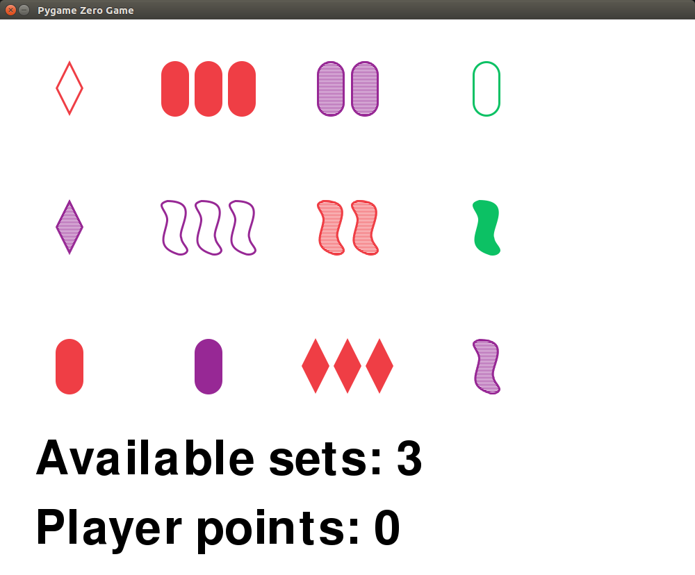

# Set

An implementation of the card game [Set](https://en.wikipedia.org/wiki/Set_(game)) in Python, using [PyGame Zero](http://pygame-zero.readthedocs.io/en/stable/).



## How to run

Install PyGame Zero:

```bash
sudo pip3 install pgzero
```

Run `set_pgz.py`:

```bash
pgzrun set_pgz.py
```

Alternatively, install the [Mu editor](https://codewith.mu/) which has a PyGame Zero mode.
